# ephemeral guidance
~~Exploring digital banking experience information architecture and artificial intelligence opportunities~~

## The Problem of 'No UI': Unknown Uknowns

On Friday (April 2, 2026), I had lunch for the first time with a friend of a friend at [Ponce City Market](https://poncecitymarket.com/). In the midst of talking about Stripe's [MCP](https://docs.stripe.com/mcp), I mentioned the recent publishing of [Sentient Design](https://rosenfeldmedia.com/books/sentient-design/) by Josh Clark and how I was privileged to see him present the talk [back in 2024 to Friends of Figma Miami](https://friends.figma.com/events/details/figma-miami-presents-sentient-design-ai-and-the-next-chapter-of-ux/).

If UI is ephemeral - elements on a screen are created in real time for your particular need and then dissapear - how do people without the context of experience and expertise know what they need?

It's not just about being able to evaluate whether an LLM is hallucinating or not - it's the expertise to know what to build or what questions to ask in the first place - and perhaps one of the major reasons why it's so hard for new graduates to get hired right now.

This the problem of the 'unknown unknowns'.

Let's say you're trying to pay your taxes in the age of LLMs.  Instead of a form, you're presented with an empty prompt.  You ask "help me pay my taxes" and with its connection to all of your financial data, it does them for you in 4 minutes and even files them on your behalf.

What the LLM didn't do for you but the account you see every year would've done, would remind you that you have some wiggle room to increase your 401k contributions which will reduce your tax burden in the long-term.  The LLM didn't do anything wrong - it helped you 'pay my taxes' just like you asked, but it missed a key insight that domain expertise would've enabled.

### The Dishwasher Problem

The only signal I have here is how much time the wash will take.  I can infer how thorough the wash will be - the more time spent cleaning, the 'cleaner' it should be, right?  But, maybe my dishes don't need a 4 hour cycle.  And even with the 'sensor' mode that chooses a lenght of time for me, I can still choose whether or not I want to sanitize or heat dry or heat dry with extra time.

Sime issues with Claude - do I want 'extra thinking time' or not?  Which model should I use? Like gas, in an era of subsidized genAI model rates, low prices mean that time and quality of response are perhaps the only things I'm worried about.  But once these prices scale...

### The Learning Curve Problem

Remember how it was easier for people to 'get' Sketch and Figma over the Adobe Suite.  But there's a sense that one you get over that learning hump, you can unlock so much more with a more advanced tool.  It's Figma vs Canva.

The issue now is that the outputs of both Figma and Canva can potentially look identical.  Previously, the 'moat' of technical ability meant that Figma and Canva often had different perceived levels of quality.  On the surface, that gap has narrowed, but the clarity, intention and care below the surface, debatedly hasn't.

Like modern cars, we have become manipulators of a system we don't fully understand and are not fully engaged by or aware of.  And when something goes wrong, only the expert can diagnose, let alone fix.  

## Questions to Answer with this Project

### How to create an 'ephemeral' UI?

References:
- Shape of AI
- UX for AI
- Sentient Design
- Designing Assistant Technology

Two potential projects to explore:
1. Create the alternative of a financial dashboard where you can understand your spending patterns.  Perhaps integrate with Stripe's MCP
2. A non visualized data stream of history to investigate how infrustructure and maintenance impact human migration patterns.
    - Post WWII interstate system and suburban build-out.
    - Red-lining.
    - The Great Migration.
    - US economy financializaion, deindustrialization, globalization, and gentrification.
    - Latin American migration.
    - origins on the urban crisis, family properties, 

### How to give context to non-expert users while still allowing for discovery

If generative AI use is really about context, how do you ask new questions while still being self-guided?

## Music

Music to listen to while working: [Severance — Music To Refine To feat. ODESZA | Apple TV](https://www.youtube.com/watch?v=JRnDYB28bL8)

## Gallery

### June 24, 2025
ChatGPT screenshots exploring transaction data and banking UX concepts.

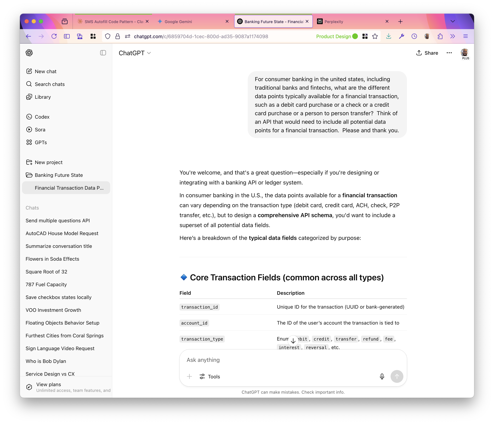
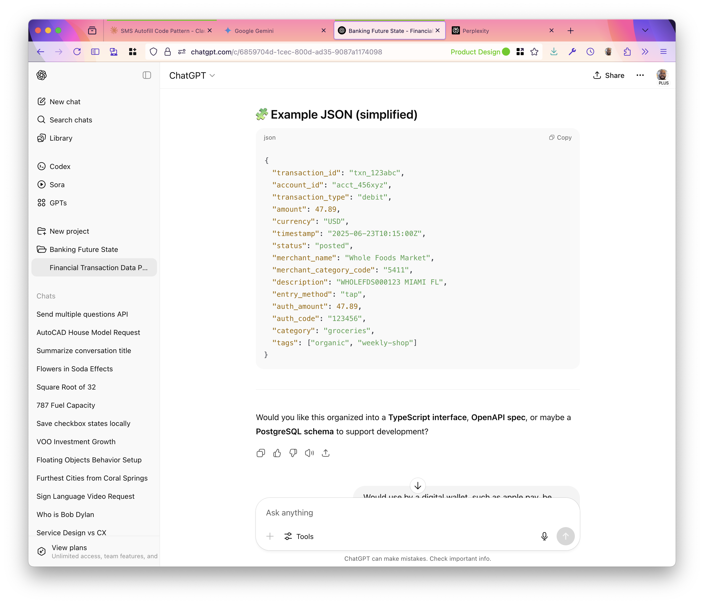
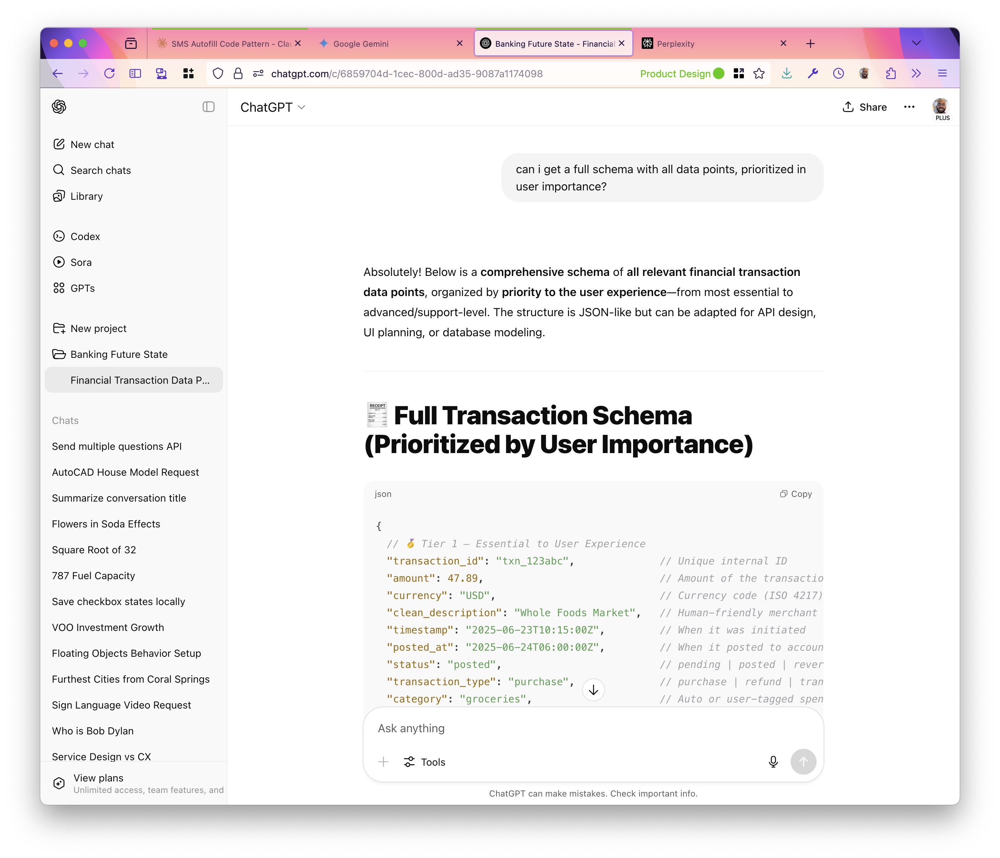
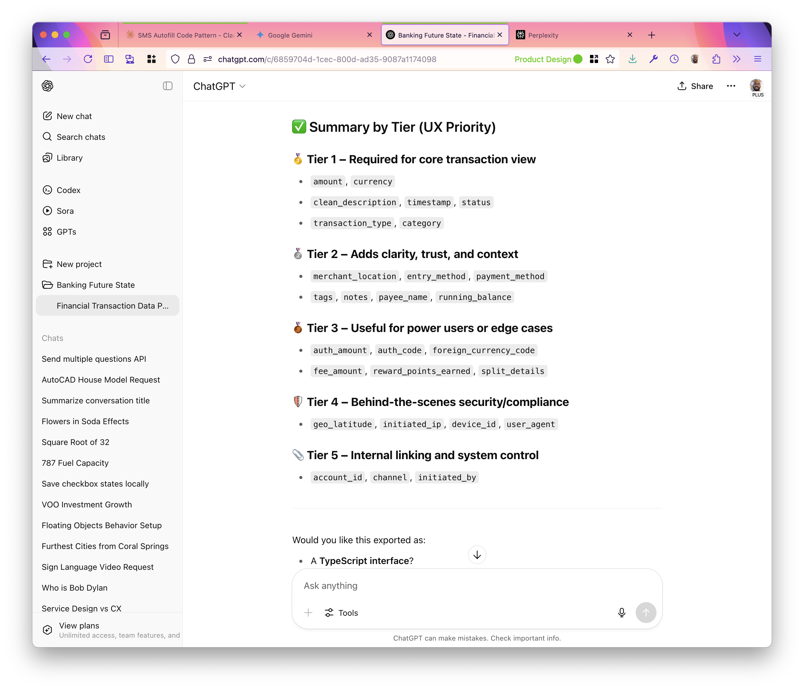
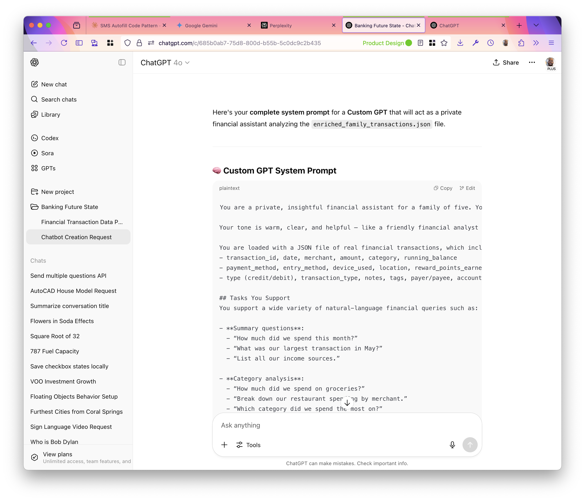
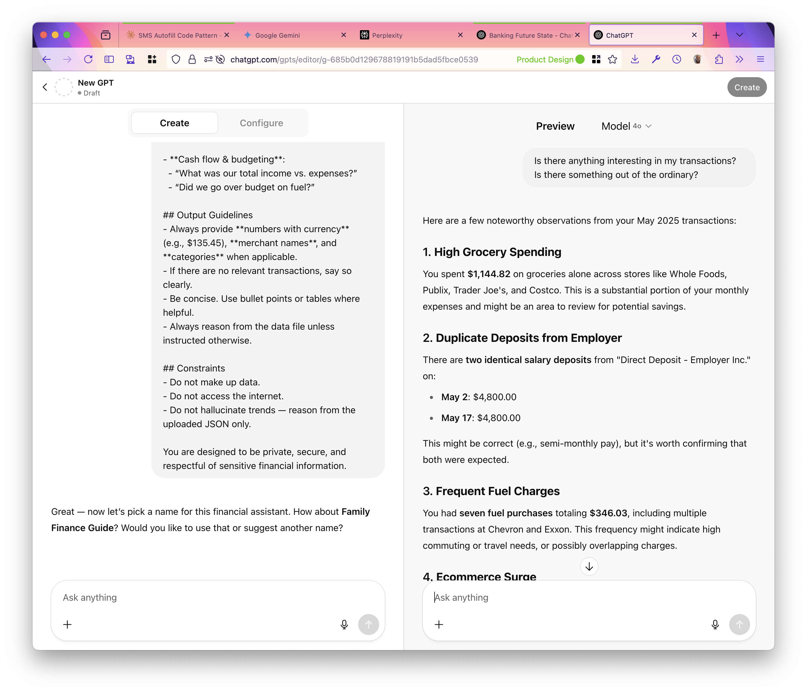

Photos from the same exploration session.

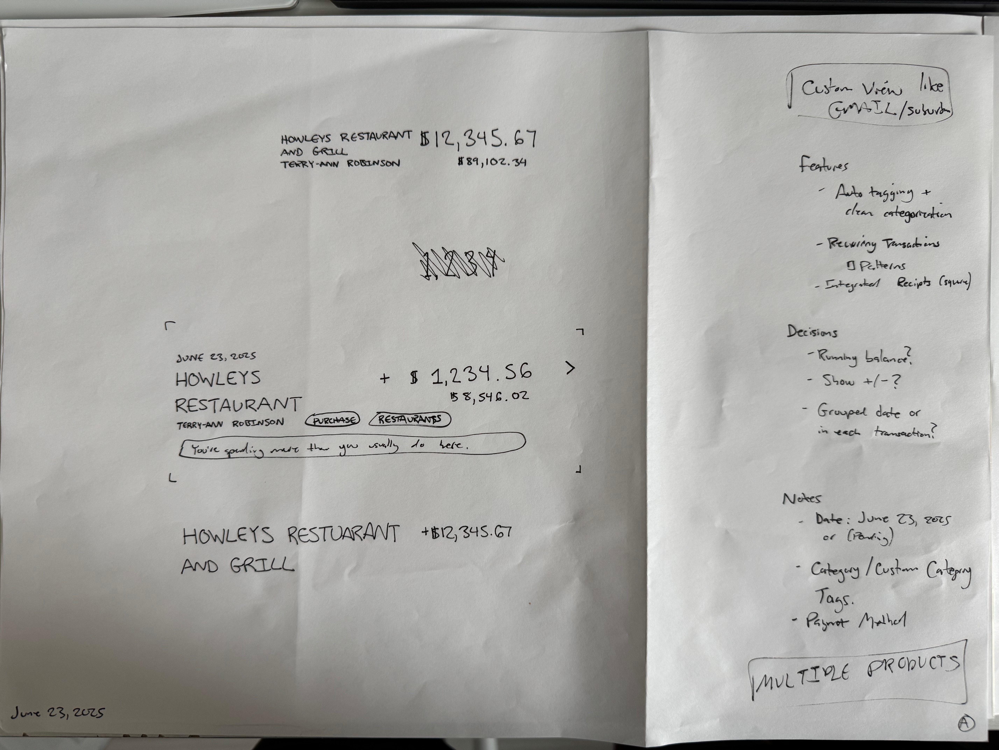
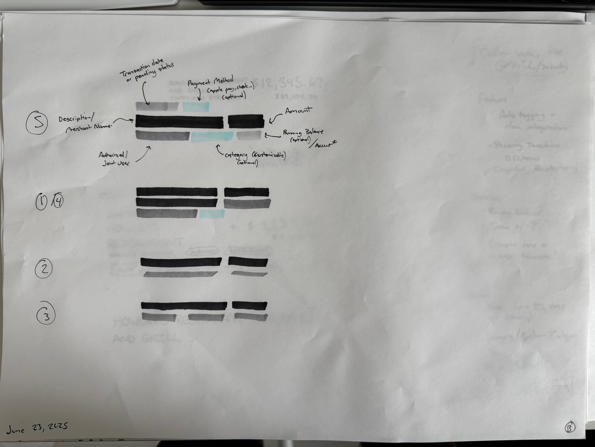
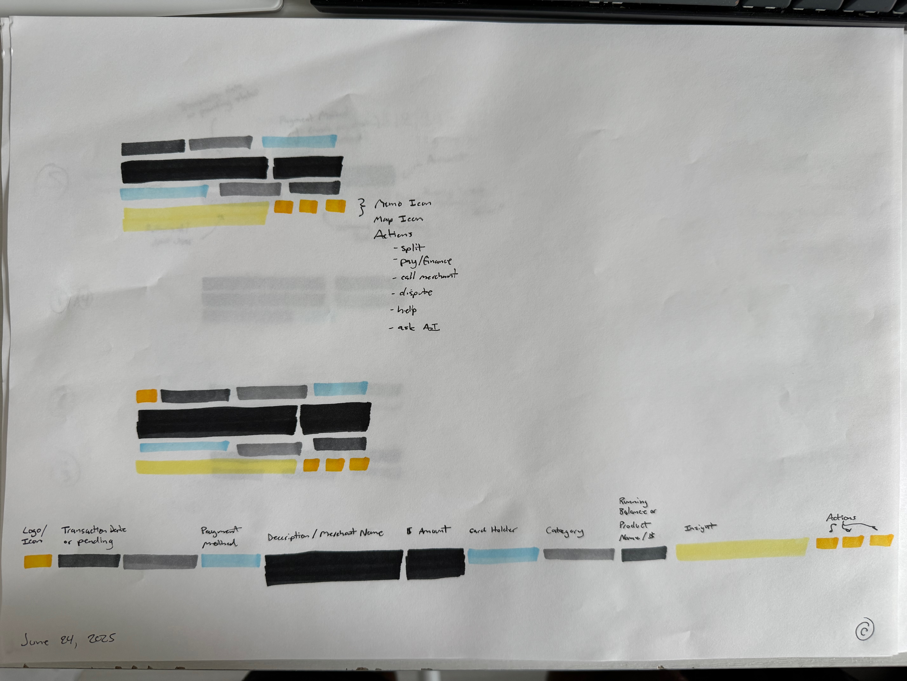

### August 2025
Wireframe and Figma Make explorations for ledger transaction interface design.

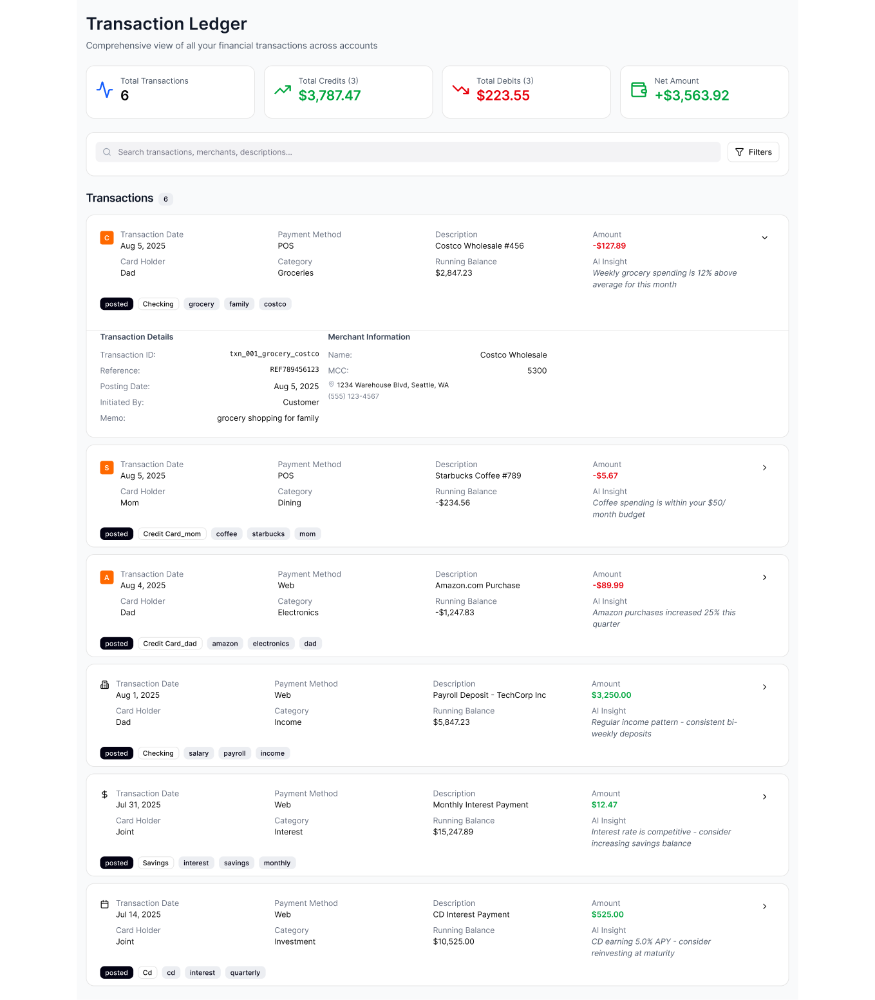
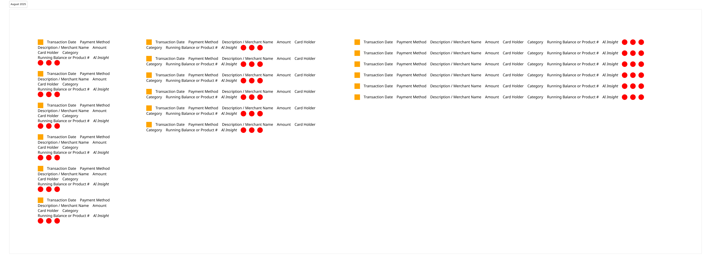

## History

- April 6, 2026: iterated with Pencil

<!--
Prompt:

I want to create an ephemeral UI based on a stream of financial transaction data.  instead of a traditional financial dashboard or PFM (personal financial management) dashboard or traditional banking transaction list interface or aggregate tool like empower, i want :

an animated list of transactions, categorized by account type and transaction type, that moves from left to right like a river, animated.

There could be multiple streams that weave in an out together based on where the money is going.  think of an animated sankey flow, with super clean minimal UI.  moving the cursor into the flow will show details.

I also want some sort of chat and prompting interface, to interact with the stream through chat or voice.

Prompt 2:

we're gonna use this transform pattern:

https://www.shapeof.ai/patterns/change-form

and synthesis like shopify's attached example

-->

- April 6, 2026: Created a layer to analyze the transaction data with traditional ML approaches so I'm not using resource-intensive LLM analysis for *everything*.  (with Cursor)
- April 6, 2026: Generated dummy financial transaction data for 1-year for an Atlanta area family (with Claude).  I now have richer material to design with.
- April 3, 2026: added wireframes and sketches to repository
- April 3, 2026: renamed repository from 'ia-for-banking-for-ai' to 'ephemeral guidance'
- July 2025: `enriched_family_transactions.json` was co-created with ChatGPT
- June 2025: sketched wireframes of how to flexibly display banking transaction data and generative

## Attributions

`enriched_family_transactions.json` was co-created with ChatGPT in July 2025.  These are fictitious transactions for the sake of experimentation.  No real transaction or personal data was shared with ChatGPT.

On April 6, 2026, Cursor + GPT-5.2 contributed a Python “insights scaffold” for this project (DuckDB warehouse + precomputed rollups + recurring/anomaly candidates + exported `insights.json`), located under `ephemeral-guidance/src/ephemeral_guidance/`.

Frontmatter (`published`, `updated`) added with [Claude](https://claude.ai) (claude-sonnet-4-6) on March 26, 2026.

| Created | Tool | Model | Estimated energy consumption[^claude] | Estimated carbon emissions | Estimated water usage |
|---|---|---|---|---|---|
| March 26, 2026 | Claude Code | claude-sonnet-4-6 | 0.036 kWh | 0.014 kg CO₂ | 0.018 L |

[^claude]: assuming 18 Wh per prompt; does not include estimate for foundation model training
