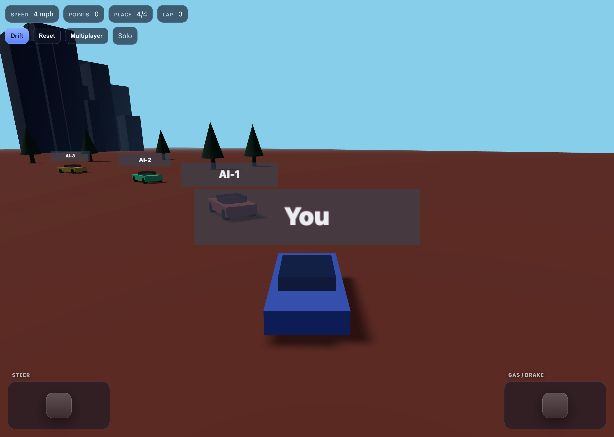

# Scravax Drift Derby (Georgia)



## Vibe Coding Creator's Notes

### How to play Scravax Drift Derby (Georgia)

- When you go above 100 mph you get five points 
- Forward and backwards is on the right lever
- left and right is on the left lever. The steering is backwards so try not to get confused about that.

### About this game

It was originally Aaron James' game published by Jason James. This game was created *on* March 10, 2026 *and* took a*n* hour to create. This game was created by ai - the software was called Claude.

You have to do six laps to win the game. If you pass all the people in these six laps, you have to go through the finish line 6 times to make that lap.

it is also a two person game you can only play on *a browser like* the app Safari *or Firefox or Google Chrome* because it was published in ~~Safari~~ *a browser* so you just have to search for scravaxdrift derby Georgia on Safari, it is not in App Store. It is only in Safari.

sometimes the reset button won’t work so if there is a little reset button at the top that usually works. ~~it is only a iPad game.~~

[click here to play the game](https://project-scravax.netlify.app/).

*Copy edits by the vibe coder's Dad*

### Credits

- **Primary author**: Aaron Jason with support from Jason James — game concept, core mechanics, tuning, and final code decisions.
- **AI assistance**: Claude (via Cursor AI) — helped draft and iterate on TypeScript, Three.js scene setup, and gameplay logic.

## Claude (via Cursor AI) Notes

A kid-friendly 3D racing prototype (ages 6+) inspired by arcade street racing and off-road vibes:

- Steer + drift
- “Minecraft-like” on-screen **levers** (touch controls) plus keyboard controls
- **+5 points** for each second you drive **over 100 mph**
- Race objective: **pass all other cars** and be **1st at the finish line**
- Multiplayer (prototype): **peer-to-peer** sync so your friend’s car appears on your screen

### Run it

```bash
npm install
npm run dev
```

Open the printed local URL on your Mac, iPad, or another device on the same network.

### Controls

- **Keyboard**: `W` accelerate, `S` brake, `A/D` steer, `Space` or `Shift` drift
- **Touch**:
  - Left lever: steer
  - Right lever: gas (up) / brake (down)
  - Tap **Drift** to toggle drift mode

### Multiplayer (2 devices)

1. On device A: click **Multiplayer** → **Create offer** → copy the offer text.
2. On device B: paste offer into **Join** → **Create answer** → copy the answer text.
3. Back on device A: paste the answer into **Set answer**.

When connected, each player will see the other player’s car.

> Note: This uses WebRTC for transport. “Bluetooth pairing” isn’t implemented in this web prototype; you can still *share the handshake text* via Messages/AirDrop (which may use Bluetooth under the hood).

### Multiplayer handshake (step‑by‑step)

To get two devices connected:

#### On Host device

1. Click **Multiplayer**.
2. Under **Host**, click **Create offer**.
3. Copy all the text that appears in the **Offer** box ( `outOffer` ) and send it to your friend (e.g., Messages/AirDrop).

#### On Joiner device

1. Open the game, click **Multiplayer**.
2. Paste that offer text into the **Offer** box under **Join** ( `inOffer` ).
3. Click **Create answer**.
4. Copy all the text that appears in the **Answer** box ( `outAnswer` ) and send it back to the host.

#### Back on Host

1. Paste the answer text into the **Answer** box under Host ( `inAnswer` ).
2. Click **Set answer**.

If everything worked, the small status pill in the HUD (top right of the buttons) should change from **Solo → Connecting → Connected**, and each player will see the other car.

## Claude (README)

Frontmatter (`published`, `updated`, `tags`) added with [Claude](https://claude.ai) (claude-sonnet-4-6) on March 26, 2026. (The game code itself was built with Claude via Cursor AI — see Credits above.)

| Created | Tool | Model | Estimated energy consumption[^claude] | Estimated carbon emissions | Estimated water usage |
|---|---|---|---|---|---|
| March 26, 2026 | Claude Code | claude-sonnet-4-6 | 0.036 kWh | 0.014 kg CO₂ | 0.018 L |

[^claude]: assuming 18 Wh per prompt; does not include estimate for foundation model training
